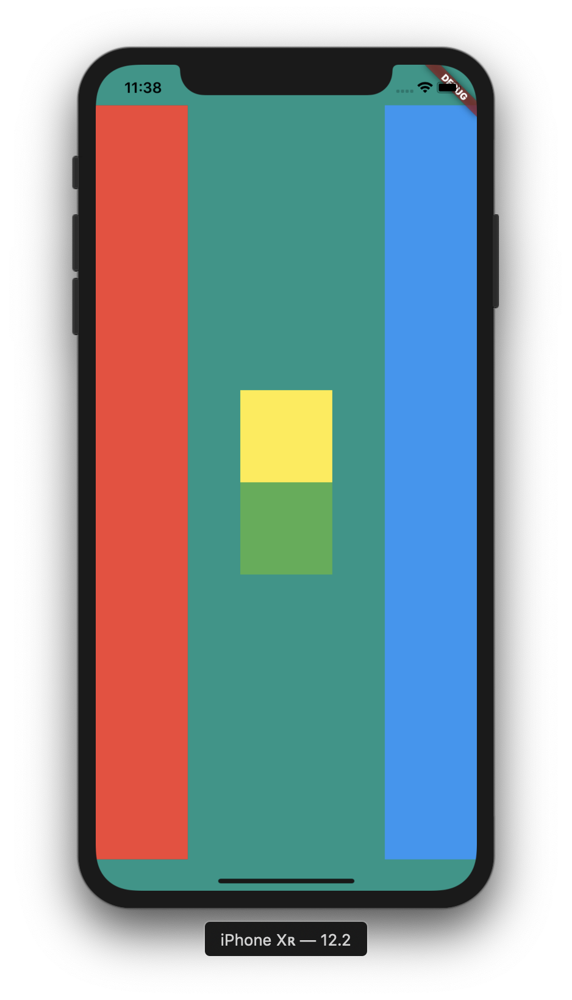
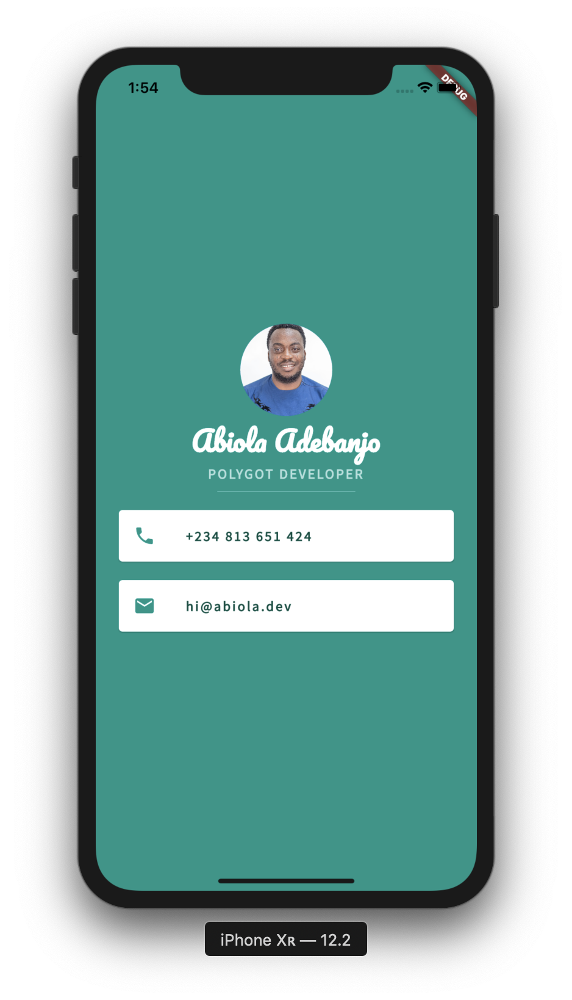
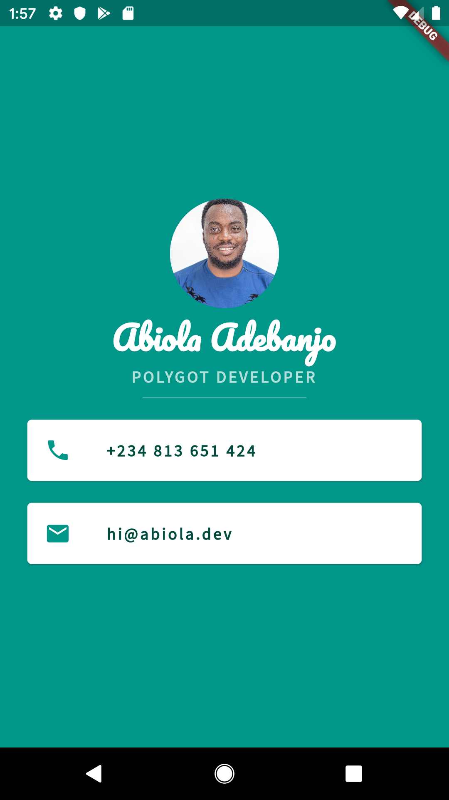

# mi_card
Mi Card is a personal business card. Imagine every time you wanted to give someone your contact details or your business card but you didn't have it on you. Well, now you can get them to download your business card as an app.

Highlights
-----

+ Learnt about hot reload and hot restart, the differences as well as when to use each
+ Container widget, properties and uses
+ Column and Row, properties and uses
+ A challenge to come apply column and row knowledge to create a copy of a layout (challenge branch)
+ Widgets and more widgets!!!
+ Custom Fonts (Google fonts specifically)
+ Icons, Card, Divider 

Screenshots
-----

